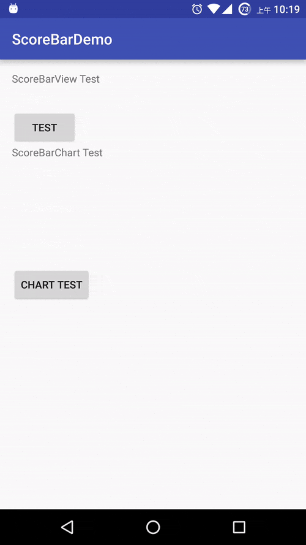

# ScoreBar
ScoreBarView &amp; ScoreBarChart

## ScoreBarView & ScoreBarChart
ScoreBarView：一个有动画，渐变颜色的分数条形图。

ScoreBarChart：ScoreBarView 组成的条形统计表。

### Demo


### Import
按需拷贝项目中的 [*ScoreBarView.java*](./app/src/main/java/com/example/neo/scorebardemo/view/ScoreBarView.java)、[*ScoreBarChart.jar*](./app/src/main/java/com/example/neo/scorebardemo/view/ScoreBarChart.java) 和 [*arrts.xml*](./app/src/main/res/values/attrs.xml) 即可。

### Usage
ScoreBarView 可配置三个属性，分别为：

| 属性名  | 描述  | 单位 | 默认值 |
| :-----: | :-----| :-- | :-----|
|barHeight | 进度条高度 | dp|32dp|
|ViewHeight | 控件高度 | dp | 与barHeight相同|
|barTextSize | 进度文字大小 | sp | 16sdp|

```
<com.example.neo.scorebardemo.view.ScoreBarView
        android:id="@+id/score_bar"
        android:layout_width="match_parent"
        android:layout_height="wrap_content"
        app:barHeight="32dp"
        app:barTextSize="16sp"
        app:viewHeight="32dp"
        />
  ```

ScoreBarChart 可配置一个属性：

属性名 | 描述 | 单位 | 默认值
 :--: | :-- | :-- | :-- 
lineSpace|行距|dp|16dp

```
<com.example.neo.scorebardemo.view.ScoreBarChart
        android:id="@+id/score_bar_chart"
        android:layout_width="match_parent"
        android:layout_height="wrap_content"
        app:lineSpace="16dp"
        />
```


